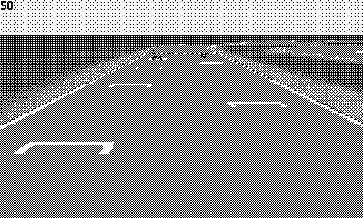

## Playdate Mode7

Playdate Mode7 is a library designed to recreate the graphics mode known as "Mode 7".

## Features

* Camera(s) with adjustable position, angle, tilt, FOV
* Customizable sprites
* Support to multiple displays (splitscreen)
* Functions to project a 3D point from the world onto the screen
* C and Lua support

## Lua setup

The library has a simplified Lua setup:
* Locate the pre-compiled binaries for your platform in the *platforms/[platform]* folder
* Copy the files (elf, dylib, dll) into the Source folder of the project
* Import the library: `import mode7`

## Documentation

* [Lua API Documentation](https://risolvipro.github.io/playdate-mode7/Lua-API.html)
* [C API Documentation](https://risolvipro.github.io/playdate-mode7/C-API.html)

## Assets

The assets included in the demo (track-0, full-car) are part of [P-Racing](https://play.date/games/p-racing/), please don't use them in your final game.